Blog Management System

Web Application Programming – Final Project

1. Project Description

The Blog Management System is a web application developed using Django and Django REST Framework that allows users to create, view, update, and delete blog posts through a secure authenticated interface.

The system demonstrates backend development, REST API creation, authentication using JWT tokens, and frontend integration using HTML, CSS, and JavaScript.

The application allows authenticated users to manage blog posts efficiently through a simple user interface.


2. Problem Statement

Managing blog content manually can be inefficient. This application provides a simple platform where users can log in and manage blog posts using a secure API-based system.


3. Key Features

* User authentication using JWT
* Secure login system
* Create new blog posts
* View blog posts
* Update existing blog posts
* Delete blog posts
* REST API endpoints
* Frontend interface for interacting with the system


4. Technology Stack

Backend

* Python
* Django
* Django REST Framework
* JWT Authentication

Database

* SQLite

Frontend

* HTML
* CSS
* JavaScript
* Django Templates

Tools

* Git
* GitHub
* Postman (API Testing)


5. Installation Instructions

Follow these steps to run the project locally.

1 Clone the Repository

```
git clone https://github.com/prarthanadaibagya/blog-project.git
```

2 Navigate to the Project Folder

```
cd blog-project
```

3 Create Virtual Environment

```
python -m venv venv
```

4 Activate Virtual Environment

Windows

```
venv\Scripts\activate
```

Mac/Linux

```
source venv/bin/activate
```

5 Install Dependencies

```
pip install -r requirements.txt
```

6 Run Migrations

```
python manage.py migrate
```

7 Create Superuser

```
python manage.py createsuperuser
```

8 Start the Development Server

```
python manage.py runserver
```

Open browser and go to:

```
http://127.0.0.1:8000
```

---

6. API Endpoints

Authentication

Login

```
POST /api/token/
```

Refresh Token

```
POST /api/token/refresh/
```

---

Blog CRUD Operations

Create Blog

```
POST /api/blogs/
```

Get All Blogs

```
GET /api/blogs/
```

Get Single Blog

```
GET /api/blogs/{id}/
```

Update Blog

```
PUT /api/blogs/{id}/
```

Delete Blog

```
DELETE /api/blogs/{id}/
```

All protected endpoints require JWT access token.


7. Application Workflow

1. User logs into the system using username and password.
2. The system returns a JWT access token.
3. The token is used to access protected API endpoints.
4. Users can create, read, update, or delete blog posts through the interface.
5. All actions interact with the backend via REST API.


8. Features Implemented

* JWT Authentication
* Login system
* CRUD operations for blog posts
* REST API endpoints
* Frontend UI for blog management
* Secure API requests
* Database integration


9. Screenshots / Demo

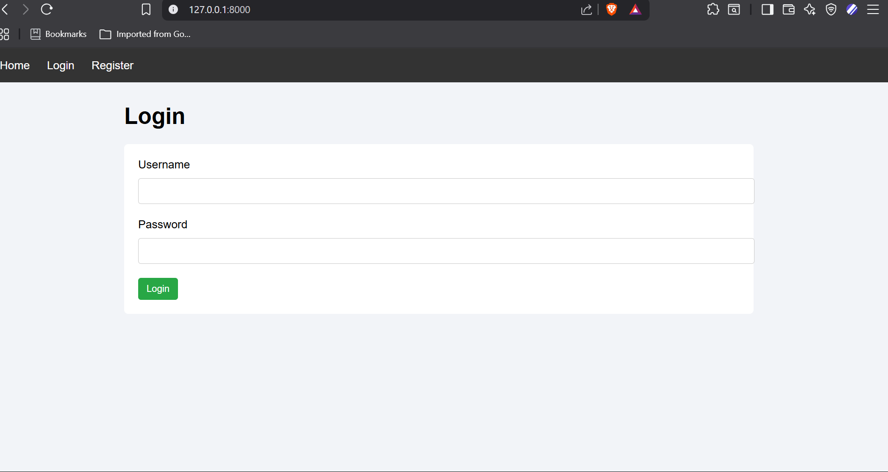
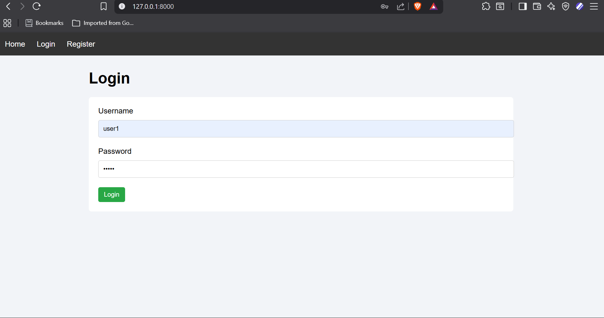
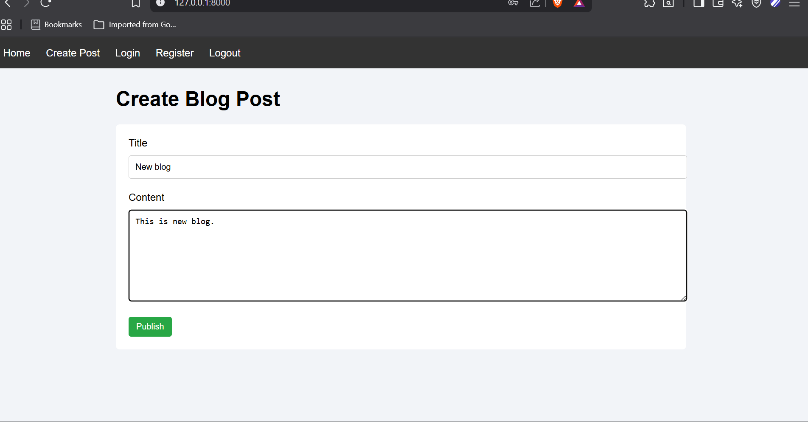
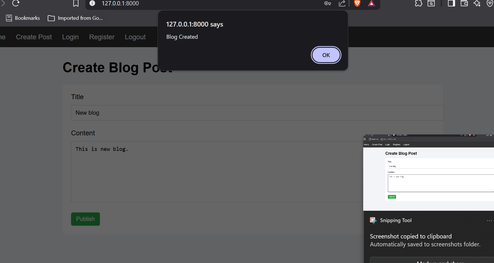
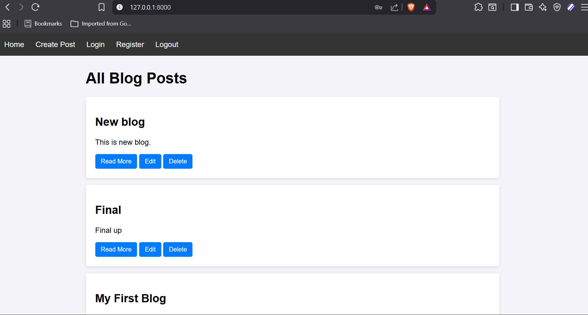
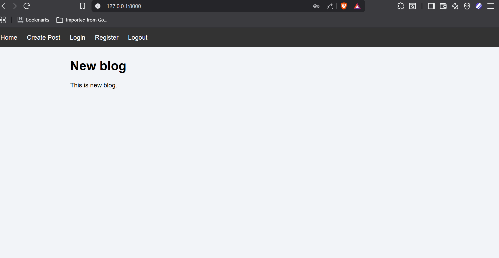
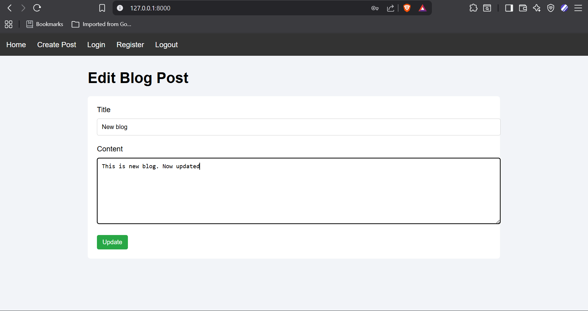
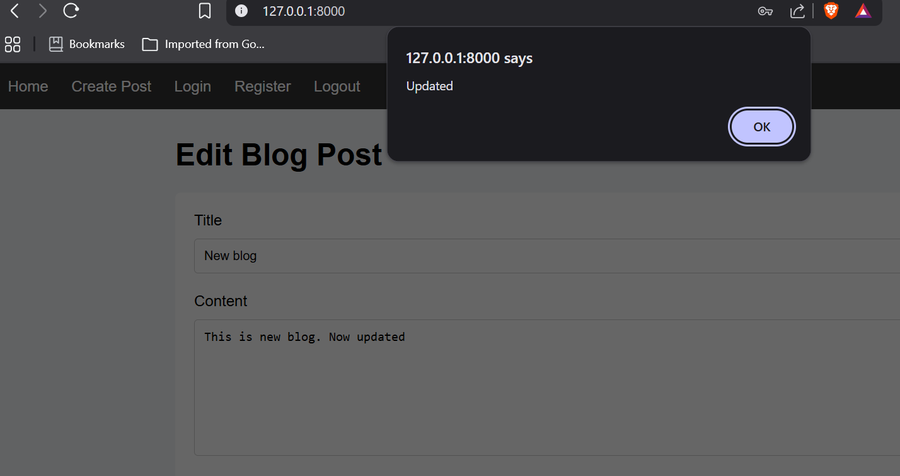
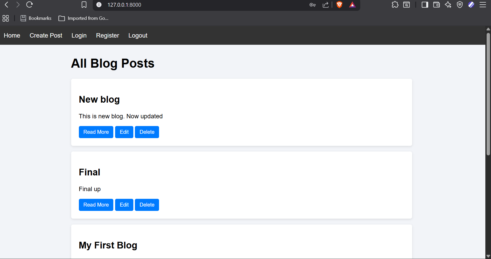
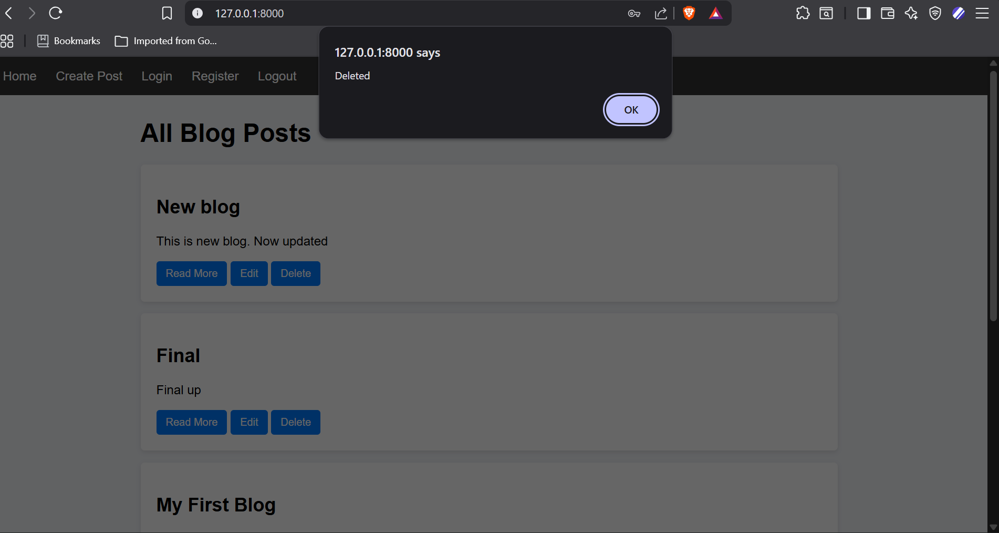
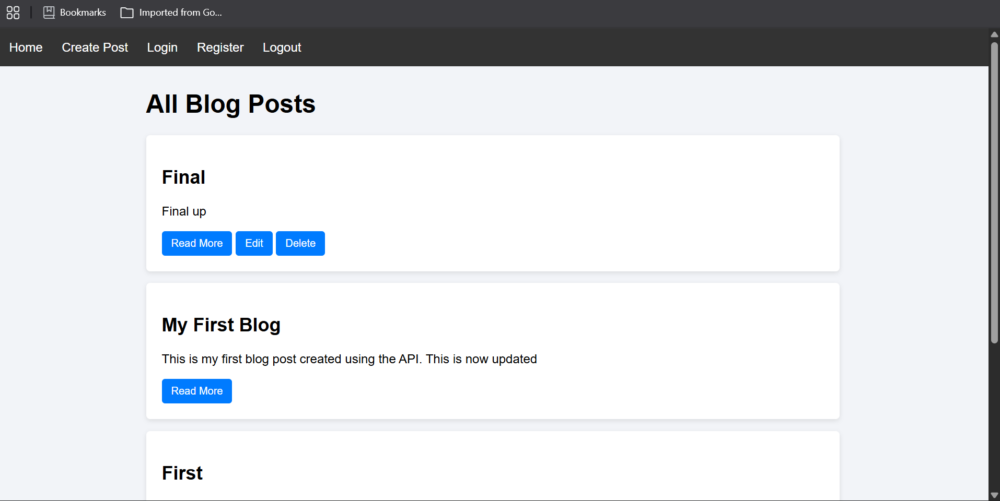
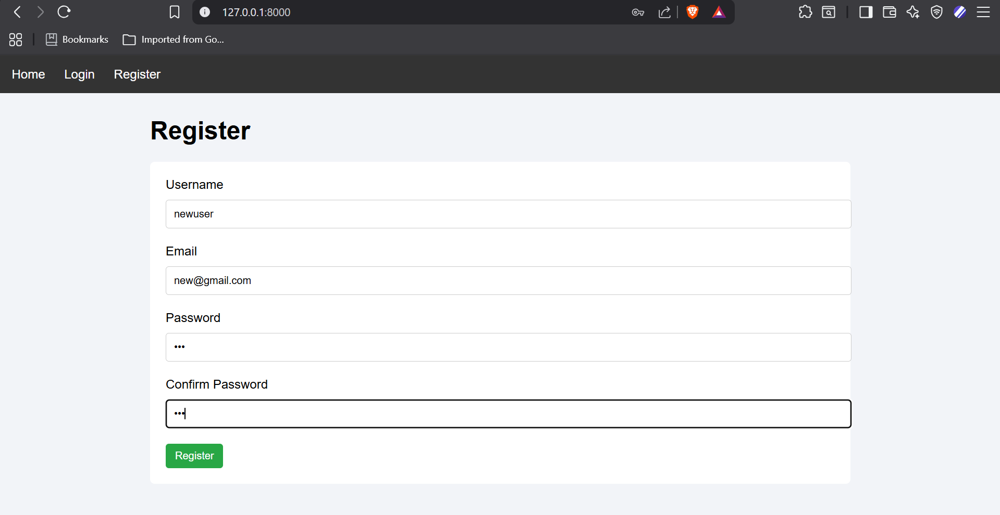
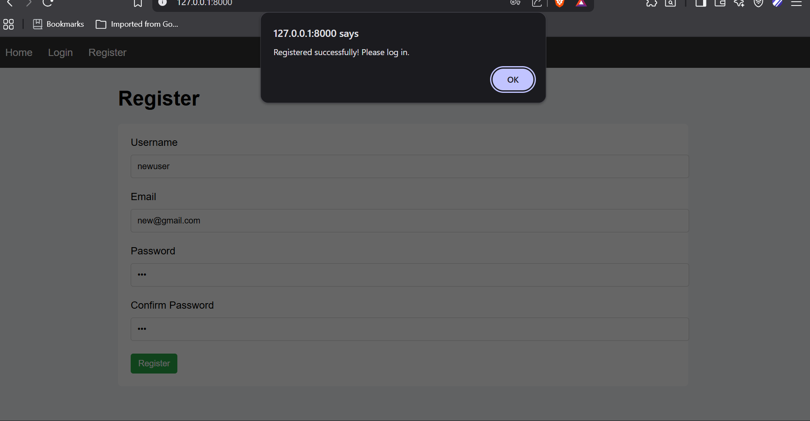

10. Version Control

The project uses Git for version control and is hosted on GitHub.

Each team member contributes through commits that reflect development progress.


11. Future Improvements

* Comment system
* User profile management
* Blog categories and tags
* Image upload support
* Pagination and search
